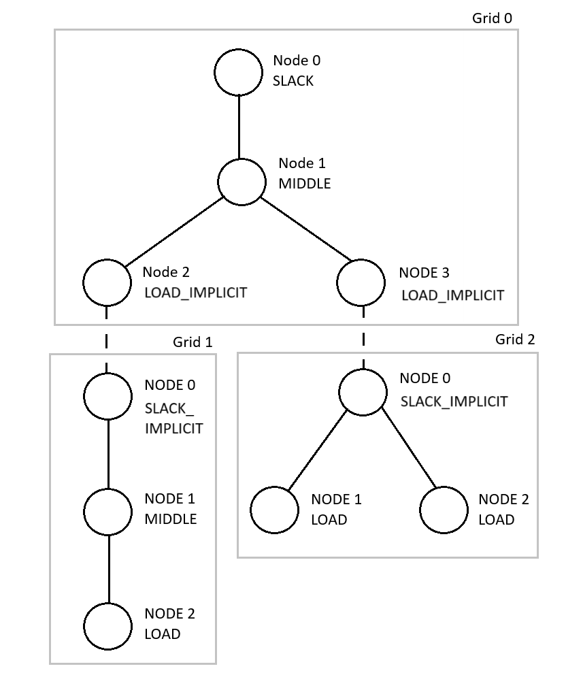

# PowerFlow

PowerFlow is a [power flow/load flow](https://en.wikipedia.org/wiki/Power-flow_study) simulation tool that can be used to calculate voltages in electrical grids given known power consumptions. PowerFlow is written in C++ for fast performance and comes with Matlab and Python bindings for use within Matlab and Python scripts.

Version 1.0 of PowerFlow was written in 2025 by a group of eight students as part of the course TDDD96 "Software Engineering - Bachelor Project" at Linköping University.

## Building

To build PowerFlow for your platform, you need [CMake](https://cmake.org/) and a suitable C++17 compiler. The instructions in this section assume the following compilers are used:

- Windows: MSVC ([Visual Studio >= 2022](https://visualstudio.microsoft.com/)).
- Linux: g++.
- Mac: clang.

In addition to CMake and a compiler, you may need additional software depending on the build target.

### Matlab

PowerFlow can be compiled into a [Matlab executable (MEX)](https://se.mathworks.com/help/matlab/cpp-mex-file-applications.html) that can then be used like any other Matlab function. To be able to compile and run the MEX file, Matlab must be installed on your computer. PowerFlow has been tested to work with Matlab version R2024b.

To compile the MEX file, execute the following in a terminal/PowerShell inside the PowerFlow root directory:

```
mkdir build
cd build
```

On Linux/macOS, run the following:
```
cmake -DCMAKE_BUILD_TYPE=Release ..
cmake --build . --target PowerFlowMex
```

On Windows:
```
cmake ..
cmake --build . --target PowerFlowMex --config Release
```

The MEX file can then be found in `build/Matlab` (`build/Matlab/Release` on Windows). Copy the MEX file to your Matlab project along with the `src/Matlab/PowerFlow.m` file, which provides an interface to the MEX file.

### Python

PowerFlow can be compiled into a [pybind11 module](https://github.com/pybind/pybind11) that can then be imported into Python 3 scripts. To build and use the Python module, you need Python 3 and pybind11 on your computer.

***NOTE:** On Windows, Python must be installed using the official installer (found [here](https://www.python.org/)), **NOT** using the Microsoft Store! During the installation, make sure to select the "Add to PATH" option.*

***NOTE:** When installing pybind11 using pip, it may be necessary to select the "global" version.*

To compile the Python module, execute the following in a terminal/PowerShell inside the PowerFlow root directory:

```
mkdir build
cd build
```

On Linux/macOS, run the following:
```
cmake -DCMAKE_BUILD_TYPE=Release ..
cmake --build . --target PowerFlowPython
```

On Windows:
```
cmake ..
cmake --build . --target PowerFlowPython --config Release
```

The resulting Python module file can then be found in `build/python` (`build/python/Release` on Windows). This file can be copied to your Python project.

### Linking to PowerFlow

It is possible to use PowerFlow as a C++ library by statically linking to the `PowerFlowLib` CMake target. The `standalone` directory contains an example showing how PowerFlow can be used within a C++ program.

## Usage

It is strongly recommended to read the "General concepts" section below before continuing with the usage instructions. For examples of use cases, see the `examples/` directory.

### General concepts

In PowerFlow, an electrical network/power network is referred to as a *network* consisting of one or more interconnected *grids* that each have an associated voltage level. A grid consists of a set of *nodes* connected by *edges*, representing the cables in the grid. A network can thus be depicted as a graph, for example:



Each edge in the graph has an associated impedance (Z) and each node has an associated quantity depending on its type (see below). *Connections* between grids (the dashed lines in the graph) represent ideal transformers.

#### Node types

A grid node is of one of the following types: LOAD, MIDDLE, SLACK_EXTERNAL or SLACK.

- LOAD nodes are nodes where the power consumption is known and the voltage is unknown.
- MIDDLE nodes are nodes that are only used for branching and connections.
- SLACK_EXTERNAL nodes are nodes where the voltage is known and the power is unknown.
- SLACK nodes are similar to SLACK_EXTERNAL nodes, but the voltage is instead specified by a connection to another grid.

Note that:

- Each grid in a network must have a voltage reference. Therefore, at least one SLACK_EXTERNAL or SLACK node must exist in each grid.
- When connecting two grids, one of the nodes has to be a SLACK node and the other node has to be a MIDDLE node.

#### Per-unit

All calculations are performed using *per-unit* values instead of actual units (Volt, Watt etc.). Per-unit for voltages and powers are defined as:

```
V_pu = V / V_base
S_pu = S / S_base
```

where *S_base* and *V_base* are positive, real-valued scale factors. Each grid in a network has an associated S_base and V_base.

#### Solvers

PowerFlow implements two different algorithms (solvers): For grids that have a single SLACK/SLACK_EXTERNAL node, contain no cycles and where the LOAD nodes are located at the "leaves", a *Backward-Forward-Sweep* (BFS) algorithm is used. For other grids, the *Gauss-Seidel* algorithm is used. PowerFlow automatically detects which solver is most suitable for each grid.

#### Limitations

Some limitations on the structure of a network are imposed by PowerFlow. It is not possible to:

- have more than one edge between a pair of node
- have disjointed graphs

### Network files

A *network file* is a text file that describes a network in a simple format that PowerFlow understands. The syntax of network files is best described by an example. The following example defines the network illustrated in the "General concepts" section:

```
# Lines beginning with # are ignored.

# The "grid" command indicates the start of a grid description.
# Since this is the first grid in the file, it will get ID 0.
grid

# S_base followed by V_base.
1000000000 10000

# Grid cables (edges) on the format: <start node> <end node> <impedance>.
# The % sign marks end of list.
0 1 (0.05, 0.05)
1 2 (0.05, 0.05)
1 3 (0.05, 0.05)
%

# Node types on the format: <node> <type>.
# <type> can be either e (SLACK_EXTERNAL), s (SLACK) or l (LOAD).
# Nodes not listed here will automatically become MIDDLE nodes.
# The % sign marks end of list. 
0 s
%

# Grid 1.
grid
10000000 400
0 1 (0.02, 0.02)
1 2 (0.05, 0.03)
%
0 s
2 l
%

# Grid 2.
grid
10000000 400
0 1 (0.02, 0.03)
0 2 (0.03, 0.03)
%
0 s
1 l
2 l
%

# Connections between grids on the format:
# <"upper" grid> <MIDDLE node in "upper" grid> <"lower" grid> <SLACK node in "lower" grid>
# The % sign marks end of list.
connections
0 2 1 0
0 3 2 0
%
```

### Using PowerFlow in a Matlab script

***NOTE:** On Ubuntu and possibly other Linux distributions, Matlab may need to be started using a command similar to `LD_PRELOAD=/lib/x86_64-linux-gnu/libstdc++.so.6 matlab`.*

You need the MEX file as well as the PowerFlow.m script in your Matlab PATH to use PowerFlow from Matlab scripts. See the build instructions on how to acquire those.

#### Loading a network

```
net = PowerFlow("path/to/network.txt", []);
```
The returned `net` variable is a pointer/handle to the loaded network. The network will be automtically garbage collected once the handle goes out of scope.

#### Solve

```
net.solve(S, V);
```

`net.solve` performs the power flow calculation. S, V and V_res are **complex** row vectors. The S vector must contain one complex value per LOAD node in the network.

In a network with *n* grids, each containing *m_1* to *m_n* number of LOAD nodes, the first *m_1* values in the S vector correspond to the load nodes in the first grid, the second *m_2* values correspond to the load nodes in the second grid and so on. The LOAD nodes are in turn ordered by their ID, i.e., a LOAD node with ID 0 comes before LOAD node with ID 3 in the S vector. In the same way, V must contain one complex value per SLACK_EXTERNAL node in the network.

#### Get LOAD node voltages

```
V_load = net.getLoadVoltages();
```

`net.getLoadVoltages` returns the calculated voltages at the LOAD nodes. The V_load vector has the same format as the S vector passed to `net.solve`.

#### Get all node voltages

```
V_all = net.getAllVoltages();
```

#### Get edge currents

```
I = net.getCurrents();
```

TODO: Fyll i format!!!!!!!!!!!!!!!!!!!!!!!!!!!!!!!!!!!!!!!!!!!!!

#### Get SLACK/SLACK_EXTERNAL node voltages

```
S_slack = net.getSlackPowers();
```

#### Passing solver options

It is possible to pass additional options to the solver using a settings struct:

```
% Max number of iterations for the entire network.
settings.maxCombinedIterations = 10000;

% Max number of iterations for the Gauss-Seidel solver.
settings.gaussSeidelMaxIterations = 100000;

% Precision for the Gauss-Seidel solver.
settings.gaussSeidelPrecision = 1e-10;

% Max number of iterations for the Backward-Forward-Sweep solver.
settings.backwardForwardSweepMaxIterations = 10000;

% Precision for the Backward-Forward-Sweep solver.
settings.backwardForwardSweepPrecision = 1e-10;

net = PowerFlow("path/to/network.txt", settings);
```

#### Thread safety

- It is **NOT** safe to load networks simultaneously on different threads!
- It is **NOT** safe to execute net.solve() simultaneously on different threads using the same network handle! However, it is safe to simultaneously execute solve() using *different* network handles.

### Using PowerFlow in a Python script

FYLL I HÄR!

## For developers

### Unit tests

To run the unit test build the project and run ./build/tests/UnitTests

Depending on compiler you can run in to problems with the path to the test networks, if this happens replace the localPath variable with the path to the repository.

### Project structure

- `examples/` - Various examples.
- `include/powerflow/` - Public headers.
- `matlab/` - Matlab implementation.
- `scripts/` - Miscellaneous files.
- `python/` - Python implementation.
- `src/` - powerflow source code.
- `standalone/` - Standalone executable.
- `tests/` - Unit tests.
